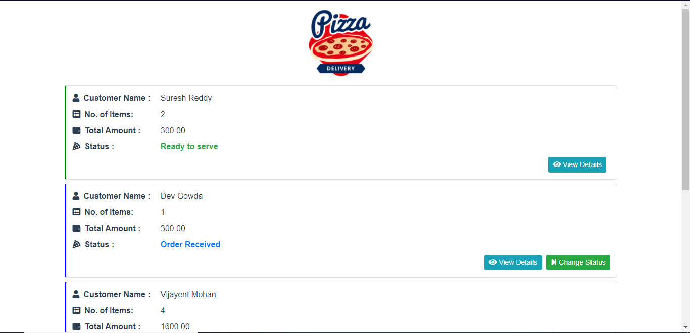
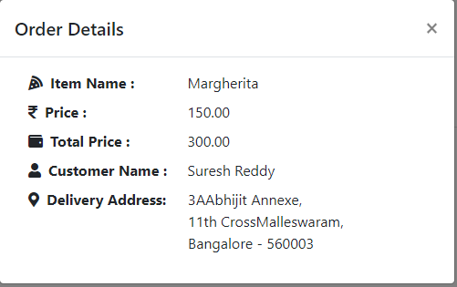

# pizza

A simple web-app💻 which helps to manage pizza orders received and change status accordingly.Frontend🖥️ comprises of simple VueJs with the integration of CSS library Bootstrap.

## Early preview
  * Orders List
  
  
  
 * Order Details
 
  
    
## Project setup
```
npm install
```

### Compiles and hot-reloads for development
```
npm run serve
```

### Compiles and minifies for production
```
npm run build
```

### Lints and fixes files
```
npm run lint
```

### Customize configuration
See [Configuration Reference](https://cli.vuejs.org/config/).
